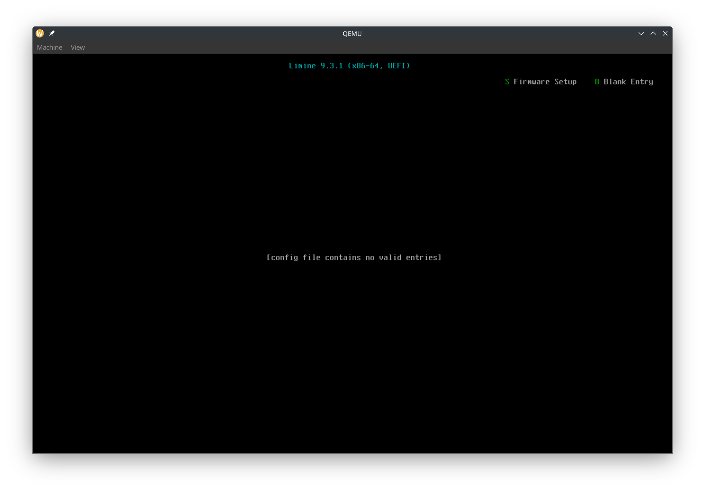

# Introduction
Do you want to write your own operating system, from hello world to automatic updates? Do you like [Linux](https://www.kernel.org/category/about.html) and [Redox OS](https://www.redox-os.org/), but want to make your own operating system from the ground up, the way you want? Do you want to write your OS in [Rust](https://www.rust-lang.org/)? Then this tutorial is for you!

# Who this is for
You don't need to know Rust but you need to be able to learn. This tutorial will not teach you Rust, but it will provide links to learn if you don't know.

# Setting up the Development Environment
If you are using [NixOS](https://nixos.org/), then most of this will be very easy for you.

You will need...
- [Rust](https://www.rust-lang.org/) installed.
- A code editor. This is entirely your preference. I would recommend [Vscodium](https://vscodium.com/) with [rust-analyzer](https://open-vsx.org/extension/rust-lang/rust-analyzer), or [Zed](https://zed.dev/).
- [Git](https://git-scm.com/)

If you are using NixOS, you can just run `nix develop` in the directory containing `flake.nix`. I recommend using [direnv](https://direnv.net/) and [nix-direnv](https://github.com/nix-community/nix-direnv) so you can simply run `direnv allow` once and then your development environment will be set up automatically every time you enter the folder. If you're using Vscodium I would also recommend using the [direnv extension](https://open-vsx.org/extension/mkhl/direnv).

# Boot Loaders
The first thing we need to do is give our operating system control of the computer.

The entry-point of an operating system is an executable file. When a computer turns on, the first thing it runs is the firmware. Modern computers have [UEFI](https://en.wikipedia.org/wiki/UEFI) firmware, and very old computers have [BIOS](https://en.wikipedia.org/wiki/BIOS). The firmware looks for operating system executable files in various locations, including internal [SSDs](https://en.wikipedia.org/wiki/Solid-state_drive) and [HDDs](https://en.wikipedia.org/wiki/Hard_disk_drive), as well as external locations such as USB disks or servers on the network.

The protocol for giving control of the computer to an operating system is different for BIOS and UEFI. Working with BIOS and UEFI can be very complicated. Operating systems have [boot loaders](https://en.wikipedia.org/wiki/Bootloader) which go between the firmware and the actual operating system's entry point. The firmware gives control to the boot loader. Then the bootloader can do its own stuff, and eventually looks for the operating system entry point and gives control to it.

There are many boot loaders and boot loader protocols. A boot loader protocol basically states "this bootloader will boot operating systems in this way", and specific boot loader implementations can implement common boot protocols. Some examples of boot loader protocols are:
- [GRUB](https://en.wikipedia.org/wiki/GNU_GRUB)
- [Multiboot](https://en.wikipedia.org/wiki/Multiboot_specification)
- The Linux Boot Protocol
- [Limine](https://github.com/limine-bootloader/limine/blob/v9.x/PROTOCOL.md)
- [The Rust OSDev Bootloader](https://github.com/rust-osdev/bootloader), written for https://os.phil-opp.com/

In this tutorial, we will use Limine, because it is modern, simple, and makes writing an OS easy for us.

# Limine
By default, Limine simply calls an entry function in our operating system. We can ask Limine to do more things for us, such as setting up other CPUs to run our operating system's code on. Before calling our entry function, Limine goes through our executable file, checking for special data which are called Limine *requests*. Limine then does the set-up that the request asked it to do, and fills that area in the executable's memory with its *response*.

It's important to know that Limine requests and responses are not like HTTP requests and responses, where the client's code and server's code is running at the same time. All Limine requests get processed *before* our OS starts, and once our OS starts, Limine is not running anymore, and all Limine responses are loaded in memory, which our OS can access.

Our initial code will be based off of [limine-rust-template](https://github.com/jasondyoungberg/limine-rust-template). We will only be targeting `x86_64`.

## Get Limine
We need two types of compiled files from Limine:
- Files that are needed to boot Limine (including `BOOTX64.EFI`)
- The actual `limine` executable, which we run on our host operating system (the operating system that you are writing the Rust code in)

If you're on NixOS, you will already have Limine from `flake.nix`. If you're not on NixOS, you can download / install it with [Limine's instructions](https://github.com/limine-bootloader/limine/tree/v9.x?tab=readme-ov-file#binary-releases). Once you have the files, make sure that the environmental variable `LIMINE_PATH` is set to the folder containing `BOOTX64.EFI`, and the `limine` executable is in your `PATH`.

# The `rust-toolchain.toml` file
Writing an operating system in Rust requires using nightly features, so we will specify a nightly toolchain. So create a `rust-toolchain.toml` file:
```toml
[toolchain]
channel = "nightly-2025-05-19"
components = ["rust-src"]
```

## Configuring Limine
Create a file `kernel/limine.conf`. Leave it empty for now. We will use it to configure Limine later.

# The Cargo workspace
We will have two Rust projects: the kernel, which is our actual operating system, and the runner, which will have programs that run our operating system in a virtual machine. For now, we'll just have the runner, and make the kernel in the next part.

Create a file `Cargo.toml`:
```toml
[workspace]
resolver = "3"
members = ["runner"]
```

Then create `runner/Cargo.toml`:
```toml
[package]
name = "runner"
version = "0.1.0"
edition = "2024"
publish = false
```

# `build.rs`
Our runner will have two Rust programs. `main.rs`, which launches the virtual machine, and `build.rs`, which builds the `.iso` file which can be used to run our OS (in a virtual machine or on a real computer). Create `runner/build.rs`:
```rs
fn main() { }
```
Cargo will run this file before running `main.rs`.

We start by reading some env vars:
```rs
// This is the folder where a build script (this file) should place its output
let out_dir = PathBuf::from(env::var("OUT_DIR").unwrap());
// This is the `runner` folder
let runner_dir = PathBuf::from(env::var("CARGO_MANIFEST_DIR").unwrap());
// This folder contains Limine files such as `BOOTX64.EFI`
let limine_dir = PathBuf::from(env::var("LIMINE_PATH").unwrap());
```
To create the ISO, we will first create a folder which we want to be the root of the ISO, and then use `xorriso` to create the ISO (make sure you have `xorriso` installed).

We want this folder structure:
```
iso_root/
├── limine.conf
├── boot
│   └── limine
│       ├── limine-bios-cd.bin
│       ├── limine-bios.sys
│       └── limine-uefi-cd.bin
└── EFI
    └── BOOT
        ├── BOOTIA32.EFI
        └── BOOTX64.EFI
```
The following code copies files to achieve this:
```rs
// We will create an ISO file for our OS
// First we create a folder which will be used to generate the ISO
// We will use symlinks instead of copying to avoid unnecessary disk space used
let iso_dir = out_dir.join("iso_root");
create_dir_all(&iso_dir).unwrap();

// Limine config will be in `limine.conf`
let limine_conf = iso_dir.join("limine.conf");
ensure_symlink(runner_dir.join("limine.conf"), limine_conf).unwrap();

let boot_dir = iso_dir.join("boot");
create_dir_all(&boot_dir).unwrap();

// Copy files from the Limine packaeg into `boot/limine`
let out_limine_dir = boot_dir.join("limine");
create_dir_all(&out_limine_dir).unwrap();
for path in [
    "limine-bios.sys",
    "limine-bios-cd.bin",
    "limine-uefi-cd.bin",
] {
    let from = limine_dir.join(path);
    let to = out_limine_dir.join(path);
    ensure_symlink(from, to).unwrap();
}

// EFI/BOOT/BOOTX64.EFI is the executable loaded by UEFI firmware
// We will also copy BOOTIA32.EFI because xorisso will complain if it's not there
let efi_boot_dir = iso_dir.join("EFI/BOOT");
create_dir_all(&efi_boot_dir).unwrap();
for efi_file in ["BOOTX64.EFI", "BOOTIA32.EFI"] {
    ensure_symlink(limine_dir.join(efi_file), efi_boot_dir.join(efi_file)).unwrap();
}
```
With the helper function:
```rs
pub fn ensure_symlink<P: AsRef<Path>, Q: AsRef<Path>>(original: P, link: Q) -> io::Result<()> {
    match remove_file(&link) {
        Ok(()) => Ok(()),
        Err(error) => match error.kind() {
            ErrorKind::NotFound => Ok(()),
            _ => Err(error),
        },
    }?;
    symlink(original, link)?;
    Ok(())
}
```

Next, we use `xorriso` to create an ISO:
```rs
// We'll call the output iso `os.iso`
let output_iso = out_dir.join("os.iso");
// This command creates an ISO file from our `iso_root` folder.
// Symlinks will be read (the contents will be copied into the ISO file)
let status = std::process::Command::new("xorriso")
    .arg("-as")
    .arg("mkisofs")
    .arg("--follow-links")
    .arg("-b")
    .arg(
        out_limine_dir
            .join("limine-bios-cd.bin")
            .strip_prefix(&iso_dir)
            .unwrap(),
    )
    .arg("-no-emul-boot")
    .arg("-boot-load-size")
    .arg("4")
    .arg("-boot-info-table")
    .arg("--efi-boot")
    .arg(
        out_limine_dir
            .join("limine-uefi-cd.bin")
            .strip_prefix(&iso_dir)
            .unwrap(),
    )
    .arg("-efi-boot-part")
    .arg("--efi-boot-image")
    .arg("--protective-msdos-label")
    .arg(iso_dir)
    .arg("-o")
    .arg(&output_iso)
    .stderr(Stdio::inherit())
    .stdout(Stdio::inherit())
    .status()
    .unwrap();
assert!(status.success());
```

Then we use the `limine` program to modify the ISO to work as a a hybrid ISO that boots on both BIOS and UEFI:
```rs
// This is needed to create a hybrid ISO that boots on both BIOS and UEFI. See https://github.com/limine-bootloader/limine/blob/v9.x/USAGE.md#biosuefi-hybrid-iso-creation
let status = std::process::Command::new("limine")
    .arg("bios-install")
    .arg(&output_iso)
    .stderr(Stdio::inherit())
    .stdout(Stdio::inherit())
    .status()
    .unwrap();
assert!(status.success());
```
Now our `build.rs` will create a `os.iso` file! The location of this file is not fixed, and is decided by Cargo. To pass the ISO's path to `main.rs`, we add:
```rs
println!("cargo:rustc-env=ISO={}", output_iso.display());
```

# `main.rs`
Let's start out with checking that `ISO` gets set:
```rs
let iso = env::var("ISO").unwrap();
println!("ISO path: {:?}", iso);
```
Then run 
```bash
cargo run
````
Example output:
```
ISO path: "/home/rajas/Documents/rust-os-tutorial/part-0/target/debug/build/runner-d62dee2feeec9cbb/out/os.iso"
```

Let's run qemu!
```rs
let ovmf = env::var("OVMF_PATH").unwrap();

// Qemu runs our OS in a virtual
let mut qemu = Command::new("qemu-system-x86_64");

// Specify the path to the ISO
qemu.arg("-cdrom");
qemu.arg(env!("ISO"));
// For UEFI on qemu, the path to OVMF.fd is needed
qemu.arg("-bios").arg(ovmf);

// Pass any args to qemu
env::args().skip(1).for_each(|arg| {
    qemu.arg(arg);
});
let exit_status = qemu.status().unwrap();
process::exit(exit_status.code().unwrap_or(1));
```
Make sure that `OVMF_PATH` points to `OVMF.fd`. It's needed for UEFI on qemu.

Now you should see the Limine menu!

