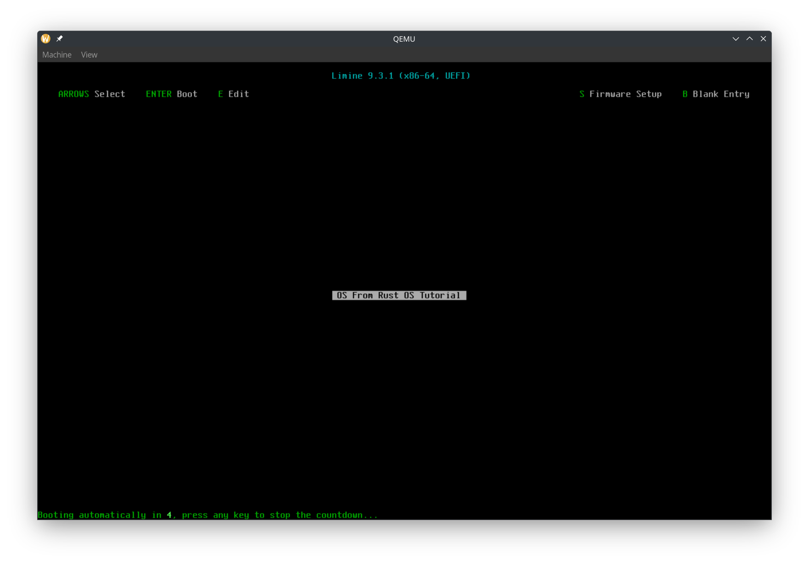

# Booting our kernel with Limine
We now have a runner which launches Limine in a VM. Now let's write the kernel that will get booted by Limine.

# The `x86_64-unknown-none` target
In Rust, targets basically are what we are compiling for. Are we compiling it as a program that can run in Linux? A program that can run in Windows? A program to run in the web with WebAssembly? For our kernel, we are targeting bare metal on `x86_64`, so we need the `x86_64-unknown-none` target. In `rust-toolchain.toml`, add
```rs
targets = ["x86_64-unknown-none"]
```

# Creating package `kernel`
Let's set the following properties in `Cargo.toml`
```toml
members = ["runner", "kernel"]
default-members = ["runner"]
```
```toml
default-members = ["runner"]
```
tells cargo that when we run `cargo run`, we want to run the binary in the `runner` project.

Create a file `kernel/Cargo.toml`:
```toml
[package]
name = "kernel"
version = "0.1.0"
edition = "2024"
publish = false

[dependencies]
limine = "0.4"
x86_64 = "0.15.2"

[[bin]]
name = "kernel"
test = false
bench = false
```

Here we have two dependencies. `limine` is the Rust library to declare Limine requests and read responses. `x86_64` contains many useful functions for bare metal `x86_64` programming.

## `main.rs`
Now it's time to actually write the operating system's code! Create a file `kernel/src/main.rs`. In the top, add
```rs
#![no_std]
#![no_main]
```
This tells rust to not use the `std` part of the standard library and to not have a normal `main` function.

Next it's time for the special data to be read by Limine, as mentioned earlier:
```rs
/// Sets the base revision to the latest revision supported by the crate.
/// See specification for further info.
/// Be sure to mark all limine requests with #[used], otherwise they may be removed by the compiler.
#[used]
// The .requests section allows limine to find the requests faster and more safely.
#[unsafe(link_section = ".requests")]
static BASE_REVISION: BaseRevision = BaseRevision::new();

/// Define the stand and end markers for Limine requests.
#[used]
#[unsafe(link_section = ".requests_start_marker")]
static _START_MARKER: RequestsStartMarker = RequestsStartMarker::new();
#[used]
#[unsafe(link_section = ".requests_end_marker")]
static _END_MARKER: RequestsEndMarker = RequestsEndMarker::new();
```

Don't worry about understanding the details of the code. What you need to know is that the `link_section`s place the `static` variables in a location that Limine reads, and the above code has 1 request, which is the base revision request. This request is to tell Limine what version of the Limine protocol we want.

Next we write our entry point function
```rs
#[unsafe(no_mangle)]
unsafe extern "C" fn entry_point_from_limine() -> ! {
    // All limine requests must also be referenced in a called function, otherwise they may be
    // removed by the linker.
    assert!(BASE_REVISION.is_supported());
    hlt_loop();
}
```
The `#[unsafe(no_mangle)]` makes sure that the compiler doesn't rename the `entry_point_from_limine` function to something else, since we need the entry point function to have a consistent name.

We mark the function as `unsafe` to reduce the chance of accidentally calling our `main` function from our own code.

We use `extern "C"` because Limine will call our function using the C calling convention.

First we check `BASE_REVISION` and make sure that it was set to 0 using the `is_supported` function. This way, we know that Limine booted our kernel using the protocol version that we expect. Also, if we do not reference the `BASE_REVISION` variable, the compiler might remove the Limine request, causing Limine to not boot our OS correctly.

Next, we do nothing. Instead of using `loop {}` to do nothing, we use call `hlt_loop`:
```rs
fn hlt_loop() -> ! {
    loop {
        x86_64::instructions::hlt();
    }
}
```
We do the [`hlt`](https://www.felixcloutier.com/x86/hlt) instruction to tell the CPU to stop. The CPU isn't guaranteed to stop forever, and it might resume doing stuff and execute the next instruction. That's why we have a forever loop in which we call `hlt`.

But we also have to add a panic handler:
```rs
#[panic_handler]
fn rust_panic(_info: &core::panic::PanicInfo) -> ! {
    hlt_loop();
}
```
When using `std`, Rust already includes a panic handler which prints a nice message. However, since we are writing Rust for bare metal, we need to specify a function which gets called if our kernel panics. Later, we can also print a pretty message with the panic error, but for now, we just call `hlt_loop`.

## Linker File
To make our kernel's executable file compatible with Limine, we need to add a linker file (`kernel/linker-x86_64.ld`). An important part to note is `ENTRY(entry_point_from_limine)`, where `entry_point_from_limine` is referencing the `entry_point_from_limine` function in our code. If you want, you can call the entry point function something else, such as `kernel_main` or `kmain`, as long as you update the function in `main.rs` as well as the linker file.

To tell Cargo to use our linker file, create `kernel/build.rs`:
```rs
use std::path::PathBuf;

fn main() {
    let arch = std::env::var("CARGO_CFG_TARGET_ARCH").unwrap();
    let dir = std::env::var("CARGO_MANIFEST_DIR").unwrap();
    let linker_file = PathBuf::from(dir).join(format!("linker-{}.ld", arch));
    let linker_file = linker_file.to_str().unwrap();

    // Tell cargo to pass the linker script to the linker..
    println!("cargo:rustc-link-arg=-T{}", linker_file);
    // ..and to re-run if it changes.
    println!("cargo:rerun-if-changed={}", linker_file);
}
```

## `.cargo/config.toml`
We also need to pass an option to `rustc`. Create `.cargo/config.toml`:
```toml
[target.x86_64-unknown-none]
rustflags = ["-C", "relocation-model=static"]
```
Without a static ELF relocation model, Limine will not boot our kernel.

## Building
At this point, we should be able to build the kernel:
```bash
cargo build --package kernel --target x86_64-unknown-none
```

# Putting the kernel in our ISO
We want the build process to be like this:
1. Build the kernel
2. Create the ISO
3. Run the ISO in qemu

We need the `runner/build.rs` to have the output binary from the `kernel` package. Cargo has a (experimental) feature that lets us do that. First, let's enable the feature by adding this to the top of `.cargo/config.toml`:
```toml
[unstable]
# enable the unstable artifact-dependencies feature, see
# https://doc.rust-lang.org/nightly/cargo/reference/unstable.html#artifact-dependencies
bindeps = true
```

Next, let's tell Rust that the `runner/build.rs` depends on the output binary from the `kernel` package. Add this to `runner/Cargo.toml`:
```toml
[build-dependencies]
kernel = { path = "../kernel", artifact = "bin", target = "x86_64-unknown-none" }
```

Now we can add this to `runner/build.rs`:
```rs
// Cargo passes us the path the to kernel executable because it is an artifact dep
let kernel_executable_file = env::var("CARGO_BIN_FILE_KERNEL").unwrap();
```
Cargo will build the kernel first before building the runner.

Let's put our kernel as `kernel`:
```rs
// Symlink the kernel binary to `kernel`
let kernel_dest = iso_dir.join("kernel");
ensure_symlink(&kernel_executable_file, &kernel_dest).unwrap();
```

# Updating Limine config
We put our kernel in `kernel`, now we need to tell Limine to add a boot option to boot it. Update `runner/limine.conf`:
```conf
# The entry name that will be displayed in the boot menu.
/OS From Rust OS Tutorial
    protocol: limine
    kernel_path: boot():/kernel
```
Note that we specify the `limine` protocol. The Limine bootloader can also boot with other protocols, but we want the Limine protocol.

# In action
Now let's run it again! Now QEMU will show our boot option, and you can boot our kernel!


# Debugging with GDB
We now made it so that there is a black screen after Limine boots our kernel. But... is our kernel working? Did it check the Limine version and enter the `hlt_loop`?

Let's debug our kernel to find out!
```bash
cargo r -- -s -S
```
The `-s` tells QEMU to start a GDB debug server at port 1234. The `-S` tells QEMU to immediately pause the VM (so that we can attach the debugger before our code runs).

Now, we need to find the path to the kernel binary. Looking at the output from the runner, our iso is at `<something>/out/os.iso`. We can get the path to the kernel at `<something>/out/iso_root/kernel`.

Make sure you have `gdb` installed. Run `gdb <kernel_file_path>`. In my case, it is:
```bash
gdb /home/rajas/Documents/rust-os-tutorial/part-1/target/debug/build/runner-f2245a6f9dda311c/out/iso_root/kernel
```
Then inside GDB, run `target remote :1234`. It should look something like this:
```
Remote debugging using :1234
0x000000000000fff0 in ?? ()
```
Now we can set a breakpoint at `hlt_loop` like this:
```
(gdb) break main.rs:36
Breakpoint 1 at 0xffffffff80000051: file kernel/src/main.rs, line 37.
```
Now let's unpause the VM with the `continue` GDB command.
```
(gdb) continue 
Continuing.

Breakpoint 1, kernel::hlt_loop () at kernel/src/main.rs:37
37          loop {
```
The Limine menu should appear, and when Limine boots our kernel, we'll reach the breakpoint. So we know it's working!
