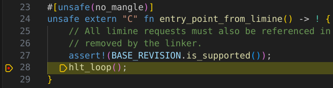

# Debugging with Vscodium
With Vscodium (or Vscode), you can easily debug our OS. No need to manually run GDB commands. 

## Extension Required
Get the ["CodeLLDB"](https://open-vsx.org/extension/vadimcn/vscode-lldb) extension. 

## `launch.json`
Then create the file `.vscode/launch.json`:
```json
{
    // Use IntelliSense to learn about possible attributes.
    // Hover to view descriptions of existing attributes.
    // For more information, visit: https://go.microsoft.com/fwlink/?linkid=830387
    "version": "0.2.0",
    "configurations": [
        {
            "name": "Debug kernel in QEMU",
            "type": "lldb",
            "request": "launch",
            "targetCreateCommands": [
                "target create ${workspaceFolder}/target/debug/build/runner-f2245a6f9dda311c/out/iso_root/kernel",
            ],
            "processCreateCommands": [
                "gdb-remote localhost:1234",
            ],
        },
    ],
}
```
Replace the path to the kernel with your own.

Now let's try it. Run
```bash
cargo run -- -s -S
```
And then in Vscodium, do "Run and Debug". It should be paused, since we passed the `-S` flag to QEMU. At this point, try setting a breakpoint. I will set a breakpoint in the `hlt_loop();` line in `entry_point_from_limine`. Then click continue in the debug tools. Once Limine boots the kernel, it should reach the breakpoint.

Much easier than using the `gdb` command manually! 

We can also nicely view the values of variables. We don't have any local variables, but you can add some to try it. We can also see the values of global variables.

You can verify that `BASE_REVISION` has a `loaded` value of `3` and `revision` value of `0`. The `revision` being `0` indicates that Limine successfully processed our base revision request. The `loaded` value of `3` indicates that our kernel was loaded with version `3` of the Limine protocol (which is the version we want).

## Out dir symlink
One inconvenient thing is that the kernel path is not constant (it could change whenever Cargo feels like it). We can workaround that by creating a symlink in `build.rs` which makes `runner/out_dir` point to the `out_dir`, where we create the `iso_root` folder and `os.iso`:
```rs
// Symlink the out dir so we get a constant path to it
ensure_symlink(&out_dir, runner_dir.join("out_dir")).unwrap();
```
Also add `runner/out_dir` to `.gitignore`. Then change the target create command to `target create ${workspaceFolder}/runner/out_dir/iso_root/kernel`.

## Automating `cargo run`
Create a `.vscode/tasks.json` file:
```json
{
	"version": "2.0.0",
	"tasks": [
		{
			"type": "cargo",
			"command": "run",
			"args": [
				"--",
				"-s",
				"-S",
			],
			"problemMatcher": [
				"$rustc",
			],
			"label": "Start QEMU with GDB Debugging",
			"isBackground": true,
			"runOptions": {
				// You can't have multiple processes listening on port 1234 at the same time
				"instanceLimit": 1,
			},
		},
	],
}
```
And in our debugging config in `launch.json`, add
```json
"preLaunchTask": "Start QEMU with GDB Debugging",
```
Now we can just click / use a keyboard shortcut, and QEMU and the debugger will start.

## Speeding up the debugging process
Add
```conf
timeout: 0
```
to the top of `limine.conf`. We don't need to interact with Limine. We just want it to boot our kernel.

Also, add
```json
"continue",
```
to the `processCreateCommands` in `launch.json`. That way as soon as the debugger connects the VM will continue executing.
