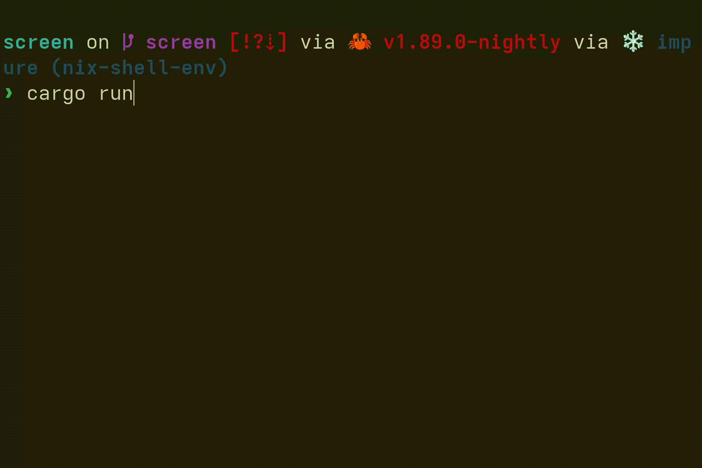

# Drawing to the Screen
Most likely, you will not be able to read from COM1 on if you run the OS on a real computer, or use a debugger on it. So let's draw to the screen to make sure that our OS works on real machines!

To draw to the screen, we will be writing to a region of memory which is memory mapped to a frame buffer. A frame buffer basically represents the pixels on the screen. You typically put a dot on the screen by writing the pixel's RGB values to the region in the frame buffer corresponding to that pixel. Limine makes it easy for us to get a frame buffer. Let's add the Limine request. Before we add the request, let's move all of the Limine-related stuff to it's own module, `limine_requests.rs`. Then let's create the request:
```rs
#[used]
#[unsafe(link_section = ".requests")]
pub static FRAME_BUFFER_REQUEST: FramebufferRequest = FramebufferRequest::new();
```
To draw shapes, text, and more, we'll use the `embedded-graphics` crate. Add it to `kernel/Cargo.toml`:
```toml
embedded-graphics = "0.8.1"
```
Then create a new file, `frame_buffer_embedded_graphics.rs`. Let's create a wrapper struct that will implement `DrawTarget`, which let's us draw to it with `embedded-graphics`.
```rs
use limine::framebuffer::Framebuffer;

pub struct FrameBufferEmbeddedGraphics<'a> {
    frame_buffer: Framebuffer<'a>,
}

impl<'a> FrameBufferEmbeddedGraphics<'a> {
    pub fn new(frame_buffer: Framebuffer<'a>) -> Self {
        let bits_per_pixel = frame_buffer.bpp();
        if bits_per_pixel == 8 * 4 {
            Self { frame_buffer }
        } else {
            panic!("DrawTarget implemented for RGB888, but bpp doesn't match RGB888");
        }
    }
}
```
In the `new` function, we make sure that the bytes per pixel is 4 (R, G, B, and an unused byte). This is because in our drawing logic, we will store each pixel as `[u8; 4]`.

Now let's implement the `Dimensions` trait, which is needed for `DrawTarget`:
```rs
impl Dimensions for FrameBufferEmbeddedGraphics<'_> {
    fn bounding_box(&self) -> embedded_graphics::primitives::Rectangle {
        Rectangle {
            top_left: Point { x: 0, y: 0 },
            size: Size {
                width: self.frame_buffer.width().try_into().unwrap(),
                height: self.frame_buffer.height().try_into().unwrap(),
            },
        }
    }
}
```

Now let's implement the `DrawTarget` trait:
```rs
impl DrawTarget for FrameBufferEmbeddedGraphics<'_> {
    type Color = Rgb888;

    type Error = Infallible;

    fn draw_iter<I>(&mut self, pixels: I) -> Result<(), Self::Error>
    where
        I: IntoIterator<Item = embedded_graphics::Pixel<Self::Color>>,
    {
        let bytes_per_pixel = (self.frame_buffer.bpp() / 8) as usize;
        pixels.into_iter().for_each(|pixel| {
            let point = pixel.0;
            if (0..self.frame_buffer.width()).contains(&(point.x as u64))
                && (0..self.frame_buffer.height()).contains(&(point.y as u64))
            {
                let color = pixel.1;
                let buffer_position = point.y as usize * self.frame_buffer.pitch() as usize
                    + point.x as usize * bytes_per_pixel;
                let pixel = self.get_pixel(color);
                let buffer = self.frame_buffer_mut();
                buffer[buffer_position..buffer_position + bytes_per_pixel].copy_from_slice(&pixel);
            }
        });
        Ok(())
    }
}
```
and to get the `[u8; 4]` for a pixel, let's add an internal method:
```rs
fn get_pixel(&self, color: Rgb888) -> [u8; 4] {
    let mut n = 0;
    n |= ((color.r() as u32) & ((1 << self.frame_buffer.red_mask_size()) - 1))
        << self.frame_buffer.red_mask_shift();
    n |= ((color.g() as u32) & ((1 << self.frame_buffer.green_mask_size()) - 1))
        << self.frame_buffer.green_mask_shift();
    n |= ((color.b() as u32) & ((1 << self.frame_buffer.blue_mask_size()) - 1))
        << self.frame_buffer.blue_mask_shift();
    n.to_ne_bytes()
}
```
Now in `main.rs`, let's use embedded graphics to draw to the screen:
```rs
let frame_buffer = FRAME_BUFFER_REQUEST.get_response().unwrap();
if let Some(frame_buffer) = frame_buffer.framebuffers().next() {
    let mut frame_buffer = FrameBufferEmbeddedGraphics::new(frame_buffer);
    frame_buffer.clear(Rgb888::MAGENTA).unwrap();
}
```
Limine gives us a slice or frame buffers, but here we only draw to the first frame buffer, if Limine has given us one.



Depending on your host computer, you might notice that this is pretty slow. `embedded-graphics` lets us implement more methods in `DrawTarget` to draw more efficiently. Let's implement `fill_solid`:
```rs
fn fill_solid(&mut self, area: &Rectangle, color: Self::Color) -> Result<(), Self::Error> {
    let pixel = self.get_pixel(color);
    let bytes_per_pixel = (self.frame_buffer.bpp() / 8) as usize;
    let pitch = self.frame_buffer.pitch() as usize;
    let buffer = self.frame_buffer_mut();
    // Draw to the top row
    for x in area.top_left.x..area.top_left.x + area.size.width as i32 {
        let buffer_position = area.top_left.y as usize * pitch + x as usize * bytes_per_pixel;
        buffer[buffer_position..buffer_position + bytes_per_pixel].copy_from_slice(&pixel);
    }
    // Copy the top row to all other rows
    let top_row_start =
        area.top_left.y as usize * pitch + area.top_left.x as usize * bytes_per_pixel;
    let top_row = top_row_start..top_row_start + area.size.width as usize * bytes_per_pixel;
    for y in area.top_left.y + 1..area.top_left.y + area.size.height as i32 {
        let row_start = y as usize * pitch + area.top_left.x as usize * bytes_per_pixel;
        buffer.copy_within(top_row.clone(), row_start);
    }
    Ok(())
}
```
Now when we fill the screen, it should draw much faster.


# Learn more
- https://wiki.osdev.org/Drawing_In_a_Linear_Framebuffer
- https://wiki.osdev.org/GOP
