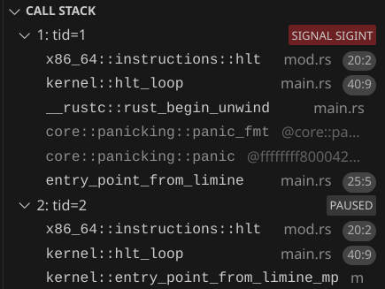
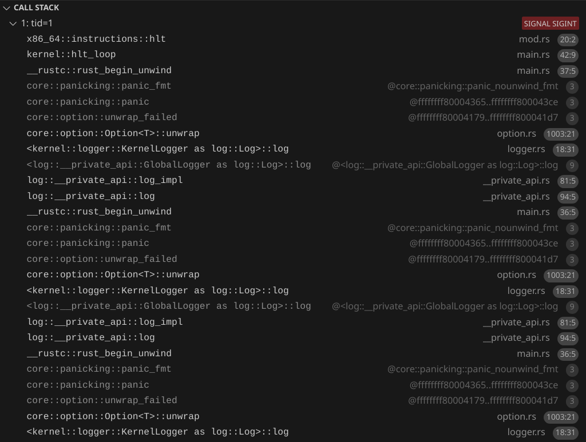

# Using all CPUs
We are in a state where we have a function that gets executed on boot. We have a logger, and we can start doing stuff. But first, let's use 100% of our computer - and by that, I mean, all of the CPUs. 

You might be thinking, *don't most computers just have 1 CPU?*. But from the kernel's perspective, every core in the CPU is like its own CPU. And actually, every thread in a CPU with hyper-threading cores counts as a CPU from the kernel's perspective. For example, on a laptop with the [i7-10610U](https://www.intel.com/content/www/us/en/products/sku/201896/intel-core-i710610u-processor-8m-cache-up-to-4-90-ghz/specifications.html) processor, looking at the specs, we would say it's a laptop with 1 CPU, with 4 cores and 8 threads. From the kernel's perspective, it's a computer with 8 CPUs.

# Limine MP Request
Limine makes running code on all CPUs very easy. We just need to use [Limine's MP request](https://github.com/limine-bootloader/limine/blob/v9.x/PROTOCOL.md#mp-multiprocessor-feature). Before we add the request, let's move all of the Limine-related stuff to it's own module, `limine_requests.rs`. Then let's create the request:
```rs
#[used]
#[unsafe(link_section = ".requests")]
pub static MP_REQUEST: MpRequest = MpRequest::new();
```
Now we can get information about the number of CPUs:
```rs
let mp_response = MP_REQUEST.get_response().unwrap();
let cpu_count = mp_response.cpus().len();
log::info!("CPU Count: {}", cpu_count);
```
We should see
```
INFO  CPU Count: 1
```
Let's try increasing the number of CPUs we have. We can tell QEMU to have 2 CPUs with `-smp 2`. Now we should see
```
INFO  CPU Count: 2
```
Now let's run some code on the other CPU. First we have to create a function which will act as an entry point for the other CPUs:
```rs
unsafe extern "C" fn entry_point_from_limine_mp(cpu: &limine::mp::Cpu) -> ! {
    hlt_loop()
}
```
Then in our initial CPU, we set write to the `goto_address` to make the other CPUs go to our function.
```rs
for cpu in mp_response.cpus() {
    cpu.goto_address.write(entry_point_from_limine_mp);
}
```
Note that even though we are writing to the `goto_address` of our own CPU, that's okay because it won't do anything on it.

Now we can confirm with our debugger that the other CPU does execute our function:



You might have to click pause on the debugger to view the call stack.

# Infinite recursive panics!
But of course, we want to log something, not just look at it through the debugger. Notice how now we could have a situation where we try to access the serial port for logging from two or more different places at once. Our `.try_lock().unwrap()` could panic, since the logger could be locked by one CPU while a different CPU tries to access it.

And in the way our kernel is right now, we could cause a panic inside of our panic handler!
```rs
log::error!("{}", info);
```
And in fact, that does happen. If we add this to our `entry_point_from_limine_mp` function:
```rs
let cpu_id = cpu.id;
log::info!("Hello from CPU {}", cpu_id);
```
The first CPU will be printing its panic message while the second CPU also tries to print at the same time, causing a panic because we `.try_lock().unwrap()`. We can see the recursive panic with the debugger:



# Preventing recursive panics
We're going to change our logger so it doesn't panic, but before that, let's change our panic handler to avoid inifinite recursive panics:
```rs
static DID_PANIC: AtomicBool = AtomicBool::new(false);
#[panic_handler]
fn rust_panic(info: &core::panic::PanicInfo) -> ! {
    match DID_PANIC.compare_exchange(false, true, Ordering::Relaxed, Ordering::Relaxed) {
        Ok(_) => {
            log::error!("{}", info);
            hlt_loop();
        }
        Err(_) => {
            hlt_loop();
        }
    }
}
```
Let's also move our panic handler to a separate file, `panic_handler.rs`, and move `hlt_loop` to `hlt_loop.rs`. Now at most, we can have two panics. And the second panic is guaranteed not to cause further panics because the `hlt_loop` function cannot cause panics. This way, if we have another bug in the logger, we don't have recursive panics again.

# Spinning to wait
Now let's replace `self.serial_port.try_lock().unwrap()` with `self.serial_port.lock()`. Now instead of panicking if the lock is held by something else, it will continuously check if the lock is free, until it becomes free. This will solve our problem, but again, be aware that we could have deadlocks and the CPU will just spin forever and it will be harder to debug deadlocks.

Now we should see this:
```rs
INFO  Hello World!
INFO  CPU Count: 2
INFO  Hello from CPU 1
```
But the order is not necessarily consistent. We can try using even more CPUs. This is what happened when I ran it with 8 CPUs:
```rs
INFO  Hello World!
INFO  CPU Count: 8
INFO  Hello from CPU 3
INFO  Hello from CPU 6
INFO  Hello from CPU 5
INFO  Hello from CPU 7
INFO  Hello from CPU 2
INFO  Hello from CPU 1
INFO  Hello from CPU 4
```
