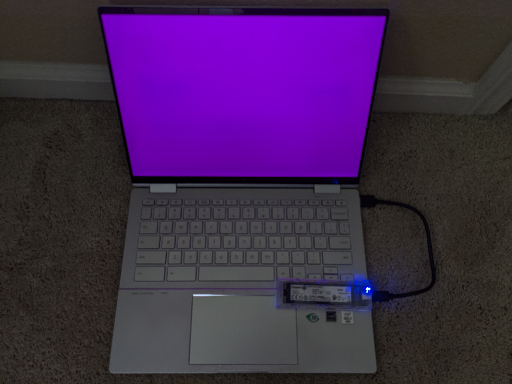

# Running on real hardware
Now that we draw something on the screen, we can see our OS in action on real computers. It should work on any x86_64 computer with UEFI or legacy BIOS.

## Writing the ISO to a disk
We can write our file at `runner/out_dir/iso_root/os.iso` to a disk in any way we want. Some tools are:
- [Etcher](https://etcher.balena.io/)
- [Rufus](https://rufus.ie/en/)
- [KDE ISO Image Writer](https://apps.kde.org/isoimagewriter/)

If you know what you are doing, you can use `dd` instead. You can also use [Ventoy](https://www.ventoy.net/en/doc_start.html), but it might not work on really old computers.

## Booting the OS
Plug in your disk (most likely you are using a USB disk, so just plug it in). When turning on your computer, you have to press a certain key to enter the boot device selection menu. On the old Lenovo computer with Legacy BIOS that I'm using, this key is F12. On Chromebooks running [MrChromebox firmware (UEFI)](https://docs.mrchromebox.tech/docs/firmware/types.html#uefi-full-rom), you can press `Esc` or `Arrow Down`. Then choose the USB disk containing your OS.

You should see the entire screen turn magneta!

Here is a picture of it on a Jinlon, a Chromebook with UEFI.

And here is a picture of it on an old Lenovo computer with Legacy BIOS.

Limine makes it easy to draw to the screen regardless of the firmware type. Limine handles the process of getting the frame buffer, which is different on UEFI than on legacy BIOS.
