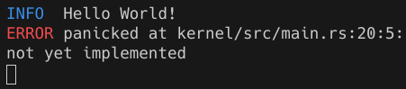
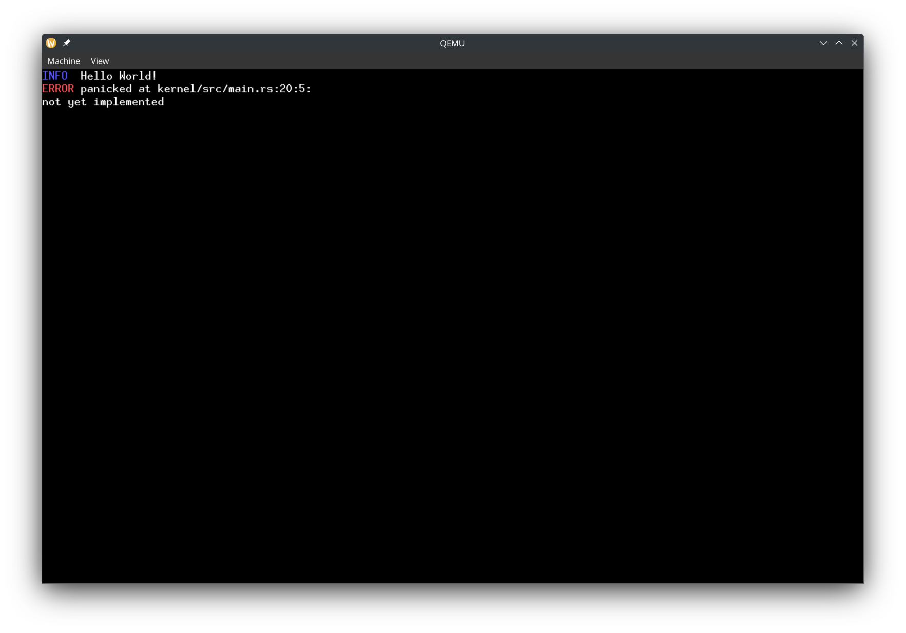

# Logging
## The `log` crate
As we expand our kernel, it will be very useful to be able to log messages. The `log` crate provides macros similar to `println`, and works on `no_std` because you have to write your own log function implementation. Add this to the kernel deps:
```toml
log = "0.4.27"
```
Then create a new file called `logger.rs`. We will be logging to two places: the serial port (COM1), and the screen (if available). Let's start with creating an empty struct which will implement the `Log` trait:
```rs
use log::Log;
use uart_16550::SerialPort;

struct KernelLogger {}

impl Log for KernelLogger {
    fn enabled(&self, _metadata: &log::Metadata) -> bool {
        todo!()
    }

    fn log(&self, record: &log::Record) {
        todo!()
    }

    fn flush(&self) {
        todo!()
    }
}
```

## Spin lock
We have to implement the `log` function, but we are only given an `&self` function. We need to put `SerialPort` in something which has interior mutability. We can use a [mutex](https://en.wikipedia.org/wiki/Lock_(computer_science)) to achieve this. Normally, we would use the `Mutex` from `std`. In `no_std`, we can use the `spinning_top` crate for a simple mutex. It works by continuously checking in a loop if the mutex is available.
```toml
spinning_top = "0.3.0"
```
We can create a struct `Inner` which will store the mutable data, and put it in a spin lock:
```rs
struct Inner {}

struct KernelLogger {
    inner: Spinlock<Inner>,
}
```


## Colors
Now let's start writing the actual logging functions. We will be making our logger colorful. The way you print colored text is different on the serial port vs the screen. On the serial port we will use [ANSI escape codes](https://en.wikipedia.org/wiki/ANSI_escape_code#Colors), which involve an escape code before and after the string we want to color. On the screen, we specify the color when drawing text using `embedded-graphics`. Let's create an enum for the colors we will be using:
```rs
/// Represents a color in a terminal or screen. The default color may depend on if the theme is light or dark.
enum Color {
    Default,
    BrightRed,
    BrightYellow,
    BrightBlue,
    BrightCyan,
    BrightMagenta,
}
```
Now let's create a function that let's us write colored text on both log outputs:
```rs
impl Inner {
    fn write_with_color(&mut self, color: Color, string: impl Display) {}
}
```
And then we can call the function in the `Log` implementation:
```rs
fn log(&self, record: &log::Record) {
    let mut inner = self.inner.try_lock().unwrap();
    let level = record.level();
    inner.write_with_color(
        match level {
            Level::Error => Color::BrightRed,
            Level::Warn => Color::BrightYellow,
            Level::Info => Color::BrightBlue,
            Level::Debug => Color::BrightCyan,
            Level::Trace => Color::BrightMagenta,
        },
        format_args!("{:5} ", level),
    );
    inner.write_with_color(Color::Default, record.args());
    inner.write_with_color(Color::Default, "\n");
}
```
Mutexes can feel like an easy fix to the issue of having immutable variables, but whenever we use mutexes we have to keep in mind the possibility of a [deadlock](https://en.wikipedia.org/wiki/Deadlock_(computer_science)). This is why we use `.try_lock().unwrap()` instead of `.lock()`, so that we panic by default if the lock is busy, so we know for sure there won't be a deadlock.

## Writing to serial
Now let's implement the actual writing to serial inside `write_with_color`. To `Inner`, add:
```rs
serial_port: SerialPort
```
We'll use `owo_colors` to handle the ANSI escape codes for us.
```toml
owo-colors = "4.2.1"
```
And then in `write_with_color`:
```rs
// Write to serial
{
    let string: &dyn Display = match color {
        Color::Default => &string,
        Color::BrightRed => &string.bright_red(),
        Color::BrightYellow => &string.bright_yellow(),
        Color::BrightBlue => &string.bright_blue(),
        Color::BrightCyan => &string.bright_cyan(),
        Color::BrightMagenta => &string.bright_magenta(),
    };
    write!(self.serial_port, "{}", string).unwrap();
}
```

## Writing to the screen
We'll need a `FrameBufferEmbeddedGraphics`, and we'll also need to keep track of the cursor position. Create a struct:
```rs
struct DisplayData {
    display: FrameBufferEmbeddedGraphics<'static>,
    position: Point,
}
```
and then add it to `Inner`:
```rs
display: Option<DisplayData>,
```
We use `Option` because there will not always be a screen. 

Then, inside `write_with_color`, add
```rs
// Write to screen
if let Some(display_data) = &mut self.display { }
```
Now there is a slightly tricky part. We are given an `impl Display`, but we need to process the text character by character. The only way to do that is to implement the `Write` trait. So let's create a temporary struct that implements the `Write` trait:
```rs
struct Writer<'a> {
    display: &'a mut FrameBufferEmbeddedGraphics<'static>,
    position: &'a mut Point,
    text_color: <FrameBufferEmbeddedGraphics<'a> as DrawTarget>::Color,
}
```
When we run out of vertical space on the screen, we'll shift everything that's on the screen up, so that we can see the new text as well as part of the old text. To do this, let's implement a `shift_up` method:
```rs
impl FrameBufferEmbeddedGraphics<'_> {
    /// Moves everything on the screen up, leaving the bottom the same as it was before
    pub fn shift_up(&mut self, amount: u32) {
        let pitch = self.frame_buffer.pitch();
        let buffer = self.frame_buffer_mut();
        buffer.copy_within(amount as usize * pitch as usize..buffer.len(), 0);
    }
}
```
To process the string character by character, we will use the `unicode-segmentation` crate's `graphemes` method.
```toml
unicode-segmentation = "1.12.0"
```
And then we can implement `Write`: 
```rs
use embedded_graphics::mono_font::iso_8859_16::FONT_10X20;

impl Write for Writer<'_> {
    fn write_str(&mut self, s: &str) -> core::fmt::Result {
        let font = FONT_10X20;
        let background_color = Rgb888::BLACK;
        for c in s.graphemes(true) {
            let height_not_seen = self.position.y + font.character_size.height as i32
                - self.display.bounding_box().size.height as i32;
            if height_not_seen > 0 {
                self.display.shift_up(height_not_seen as u32);
                self.position.y -= height_not_seen;
            }
            match c {
                "\r" => {
                    // We do not handle special cursor movements
                }
                "\n" | "\r\n" => {
                    // Fill the remaining space with background color
                    Rectangle::new(
                        *self.position,
                        Size::new(
                            self.display.bounding_box().size.width
                                - self.position.x as u32,
                            font.character_size.height,
                        ),
                    )
                    .into_styled(
                        PrimitiveStyleBuilder::new()
                            .fill_color(background_color)
                            .build(),
                    )
                    .draw(self.display)
                    .map_err(|_| core::fmt::Error)?;
                    self.position.y += font.character_size.height as i32;
                    self.position.x = 0;
                }
                c => {
                    let style = MonoTextStyleBuilder::new()
                        .font(&font)
                        .text_color(self.text_color)
                        .background_color(background_color)
                        .build();
                    *self.position =
                        Text::with_baseline(c, *self.position, style, Baseline::Top)
                            .draw(self.display)
                            .map_err(|_| core::fmt::Error)?;
                    if self.position.x as u32 + font.character_size.width
                        > self.display.bounding_box().size.width
                    {
                        self.position.y += font.character_size.height as i32;
                        self.position.x = 0;
                    }
                }
            }
        }
        Ok(())
    }
}
```
And let's use our `Writer`:
```rs
let mut writer = Writer {
    display: &mut display_data.display,
    position: &mut display_data.position,
    text_color: match color {
        Color::Default => Rgb888::WHITE,
        // Mimick the ANSI escape colors
        Color::BrightRed => Rgb888::new(255, 85, 85),
        Color::BrightYellow => Rgb888::new(255, 255, 85),
        Color::BrightBlue => Rgb888::new(85, 85, 255),
        Color::BrightCyan => Rgb888::new(85, 255, 255),
        Color::BrightMagenta => Rgb888::new(255, 85, 255),
    },
};
write!(writer, "{}", string).unwrap();
```
Now we're done implementing the `Log` trait!

## Logger global variable
Now let's have a global variable for our logger and a function to initialize our logger.
```rs
static LOGGER: KernelLogger = KernelLogger {
    inner: Spinlock::new(Inner {
        serial_port: unsafe { SerialPort::new(0x3F8) },
        display: None,
    }),
};

pub fn init(frame_buffer: &'static FramebufferResponse) -> Result<(), log::SetLoggerError> {
    let mut inner = LOGGER.inner.try_lock().unwrap();
    inner.serial_port.init();
    inner.display = frame_buffer
        .framebuffers()
        .next()
        .map(|frame_buffer| DisplayData {
            display: FrameBufferEmbeddedGraphics::new(frame_buffer),
            position: Point::zero(),
        });
    log::set_max_level(LevelFilter::max());
    log::set_logger(&LOGGER)
}
```
Note that the `log` crate requires us to set a level filter, which lets us choose to only log messages with a certain importance. For example, we can set the level filter to only log warn and error messages, and not log info, debug, or trace messages. You can try it out by setting the max level to `LevelFilter::Warn`. Then you will not see any messages from `log::info`.

## Using the logger
Now we can log from `main.rs` like this:
```rs
let frame_buffer_response = FRAME_BUFFER_REQUEST.get_response().unwrap();
logger::init(frame_buffer_response).unwrap();
log::info!("Hello World!");
```
Remove the drawing the screen magenta code.

## Logging panics
Now that we have a logger, let's update our panic handler:
```rs
#[panic_handler]
fn rust_panic(info: &core::panic::PanicInfo) -> ! {
    log::error!("{}", info);
    hlt_loop();
}
```

## Results
To check our panic handler, let's temporarily put `todo!()` before `hlt_loop` in our entry function. Now we should see
```
INFO  Hello World!
ERROR panicked at kernel/src/main.rs:20:5:
not yet implemented
```
Which will look like this on a terminal:



And on a screen:


