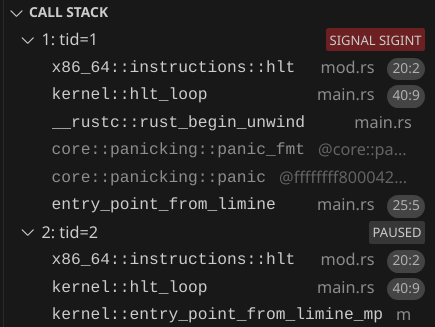
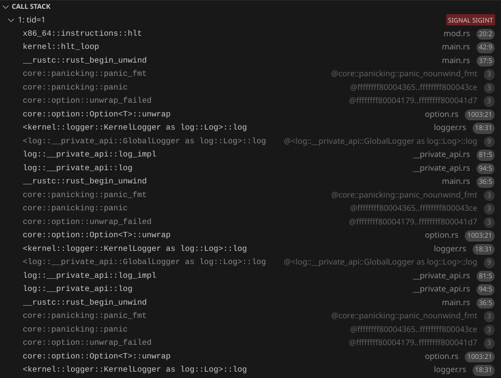

# Using all CPUs
We are in a state where we have a function that gets executed on boot. We have a logger, and we can start doing stuff. But first, let's use 100% of our computer - and by that, I mean, all of the CPUs. 

You might be thinking, *don't most computers just have 1 CPU?*. But from the kernel's perspective, every core in the CPU is like its own CPU. And actually, every thread in a CPU with hyper-threading cores counts as a CPU from the kernel's perspective. For example, on a laptop with the [i7-10610U](https://www.intel.com/content/www/us/en/products/sku/201896/intel-core-i710610u-processor-8m-cache-up-to-4-90-ghz/specifications.html) processor, looking at the specs, we would say it's a laptop with 1 CPU, with 4 cores and 8 threads. From the kernel's perspective, it's a computer with 8 CPUs.

# Limine MP Request
Limine makes running code on all CPUs very easy. We just need to use [Limine's MP request](https://github.com/limine-bootloader/limine/blob/v9.x/PROTOCOL.md#mp-multiprocessor-feature).
```rs
#[used]
#[unsafe(link_section = ".requests")]
pub static MP_REQUEST: MpRequest = MpRequest::new().with_flags(RequestFlags::X2APIC);
```
We use the `X2APIC` request flag. This tutorial will explain more about what that is in a later part. For now, you just need to know that this flag is needed for Limine to boot our kernel when there are >256 CPUs.

Up until now, our code has only been running on 1 CPU. This CPU is called the bootstrap processor (BSP). Let's change our hello world to say `"Hello from BSP"`.

The other CPUs are called application processors (APs). Limine has already started the APs for us, and they are waiting to jump to a function.

Let's make a function for the APs:
```rs
unsafe extern "C" fn entry_point_from_limine_mp(_cpu: &limine::mp::Cpu) -> ! {
    // log::info!("Hello from AP");
    hlt_loop()
}
```

Using the MP request, we can run the function in all of the APs:
```rs
let mp_response = MP_REQUEST.get_response().unwrap();
for cpu in mp_response.cpus() {
    cpu.goto_address.write(entry_point_from_limine_mp);
}
```

By default, QEMU only gives the VM 1 CPU. We can specify the number of CPUs using the `--smp` flag. Let's test it out by using `--smp 2` and using the debugger to confirm that the other CPU does execute our function:



You might have to click pause on the debugger to view the call stack.

# Infinite recursive panics!
But of course, we want to log something, not just look at it through the debugger. Notice how now we could have a situation where we try to access the serial port for logging from two or more different places at once. Our `.try_lock().unwrap()` could panic, since the logger could be locked by one CPU while a different CPU tries to access it.

And in the way our kernel is right now, we could cause a panic inside of our panic handler!
```rs
log::error!("{}", info);
```
And in fact, that does happen. Uncomment the `"Hello from AP"` and run it. The first CPU will be printing its panic message while the second CPU also tries to print at the same time, causing a panic because we `.try_lock().unwrap()`. We can see the recursive panic with the debugger:



# Preventing recursive panics
We're going to change our logger so it doesn't panic, but before that, let's change our panic handler to avoid infinite recursive panics:
```rs
static DID_PANIC: AtomicBool = AtomicBool::new(false);
#[panic_handler]
fn rust_panic(info: &core::panic::PanicInfo) -> ! {
    if !DID_PANIC.swap(true, Ordering::Relaxed) {
        log::error!("{info}");
        hlt_loop();
    } else {
        hlt_loop();
    }
}
```
Let's also move our panic handler to a separate file, `panic_handler.rs`, and move `hlt_loop` to `hlt_loop.rs`. Now at most, we can have two panics. And the second panic is guaranteed not to cause further panics because the `hlt_loop` function cannot cause panics. This way, if we have another bug in the logger, we don't have recursive panics again.

# Spinning to wait
Now let's replace `self.inner.try_lock().unwrap()` with `self.inner.lock()`. Now instead of panicking if the lock is held by something else, it will continuously check if the lock is free, until it becomes free. This will solve our problem, but again, be aware that if a deadlock happens, the CPU will just spin forever and it will be harder to debug than a panic.

Now we should see this (the order can vary depending on which CPU gets the lock first):
```rs
INFO  Hello from BSP
INFO  Hello from AP
```
And when running with `--smp 8`:
```
INFO  Hello from BSP
INFO  Hello from AP
INFO  Hello from AP
INFO  Hello from AP
INFO  Hello from AP
INFO  Hello from AP
INFO  Hello from AP
INFO  Hello from AP
```
