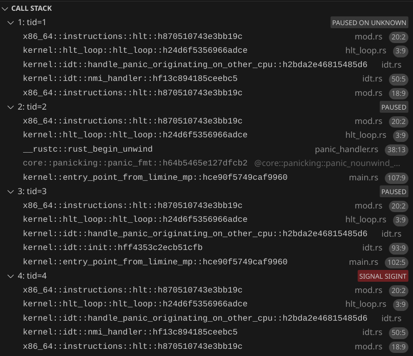

# Sending IPIs
Now that we got a `LocalApic`, we can send interrupts between CPUs.

## Improving the panic handler
Right now, in our panic handler, we stop the CPU from executing any code by calling `hlt_loop`. However, this only stops the current CPU. The other CPUs will continue running, which is not good. Let's send inter-processor interrupt to tell all the other CPUs to stop. Since it is very important that the other CPUs should stop, we'll send a non-maskable interrupt (NMI). An NMI interrupt the CPU even if it has interrupts disabled. 

This should be simple. We can just tell the Local APIC on the CPU that the panic happened on to send an IPI to all other CPUs, right? Well, there is one thing we need to consider. The other CPUs might not have their IDT set up to handle NMIs. In this scenario, they will receive an NMI, but since the IDT is not set up, a triple fault will happen on the other CPU, causing a system reset (and then we can't see the panic message!). We'll make it so that in this scenario, we won't send an NMI to the CPU which hasn't set up its IDT yet. We will instead leave a note saying "The kernel panicked before you set up your IDT. You should stop now." We can do this with the power of atomics!

Important note: due to a bug in the `x2apic` crate, update your `Cargo.toml` to use a patched version:
```rs
x2apic = { git = "https://github.com/ChocolateLoverRaj/x2apic-rs", branch = "fix-id", version = "0.5.0" }
```

### Atomically keep track of which CPUs loaded their IDT
Create a file `nmi_handler_states.rs`. We will create an enum to represent whether a CPU has set its NMI handler or not (which is effectively the same as whether the CPU has loaded its IDT or not).
```rs
pub enum NmiHandlerState {
    /// If this CPU receives an NMI, it will probably cause a triple fault
    NmiHandlerNotSet,
    /// If this CPU receives an NMI, the kernel's NMI handler function will be called
    NmiHandlerSet,
    /// If you see this while trying to set the NMI, just call the NMI handler now
    KernelPanicked,
}
```
But we want to access this state atomically. We can use the `atomic_enum` crate for this.
```toml
atomic_enum = "0.3.0"
```
What this crate does is internally use an atomic integer and handle the conversions for us.

So add
```rs
use atomic_enum::atomic_enum;
```
and above the enum, add
```rs
#[atomic_enum]
```
Then let's create a global variable that will store the states for all CPUs, similar to how we store CPU local data.
```rs
pub static NMI_HANDLER_STATES: Once<BTreeMap<u32, AtomicNmiHandlerState>> = Once::new();

pub fn init(mp_response: &MpResponse) {
    NMI_HANDLER_STATES.call_once(|| {
        mp_response
            .cpus()
            .iter()
            .map(|cpu| {
                (
                    cpu.lapic_id,
                    AtomicNmiHandlerState::new(NmiHandlerState::NmiHandlerNotSet),
                )
            })
            .collect()
    });
}
```
And then in `main.rs` let's initialize it before we initialize CPU local data:
```rs
nmi_handler_states::init(mp_response);
```

### Updating the IDT code
In `idt.rs`, let's create an NMI handler:
```rs
fn handle_panic_originating_on_other_cpu() -> ! {
    hlt_loop()
}

extern "x86-interrupt" fn nmi_handler(_stack_frame: InterruptStackFrame) {
    handle_panic_originating_on_other_cpu()
}
```
and when creating the IDT:
```rs
idt.non_maskable_interrupt.set_handler_fn(nmi_handler);
```
After calling `idt.load()`, add
```rs
// Now that we loaded the IDT, we are ready to receive NMIs
// Let's update our state to indicate that we are ready to receive NMIs
if NMI_HANDLER_STATES
    .get()
    .unwrap()
    .get(&local.cpu.lapic_id)
    .unwrap()
    .compare_exchange(
        NmiHandlerState::NmiHandlerNotSet,
        NmiHandlerState::NmiHandlerSet,
        Ordering::AcqRel,
        Ordering::Acquire,
    )
    .is_err()
{
    // `compare_exchange` will "fail" if the value is currently not what we expected it to be.
    // In this case, the kernel already panicked and updated our state to `KernelPanicked` before we tried to indicate that we are ready to receive NMIs.
    handle_panic_originating_on_other_cpu()
};
```

### Updating the panic handler
In the panic handler, before logging the panic message, add
```rs
// Since the OS panicked, we need to tell the other CPUs to stop immediately
// However, if we send an NMI to a CPU that didn't load its IDT yet, the system will triple fault
if let Some(local) = try_get_local()
    && let Some(mut local_apic) = local
        .local_apic
        .get()
        .and_then(|local_apic| local_apic.try_lock())
{
    for (cpu_lapic_id, nmi_handler_state) in NMI_HANDLER_STATES
        .get()
        .unwrap()
        .iter()
        // Make sure to not send an NMI to our own CPU
        .filter(|(cpu_lapic_id, _)| **cpu_lapic_id != local.cpu.lapic_id)
    {
        if let NmiHandlerState::NmiHandlerSet =
            nmi_handler_state.swap(NmiHandlerState::KernelPanicked, Ordering::Release)
        {
            // Safety: since the kernel is panicking, we need to tell the other CPUs to hlt
            unsafe { local_apic.send_nmi(*cpu_lapic_id) };
        }
    }
}
```

### Trying it out
In `entry_point_from_limine_mp`, before `idt::init();` add
```rs
if cpu_id == 2 {
    for _ in 0..20000000 {}
}
```
and after `local_apic::init()`, add
```rs
if cpu_id == 1 {
    for _ in 0..10000000 {}
    panic!("test panic");
}
```
Then run QEMU with 4 CPUs. We would expected the following to happen:
- CPUs 0 (BSP), 1, and 3 load their IDT
- CPU 1 panics, sending an NMI to CPUs 0 and 3
- CPUs 0 and 3 receive the NMI and do `hlt_loop()`
- CPU 2 loads its IDT
- CPU 2 realizes that the kernel already panicked and does `hlt_loop()`

And with our debugger, we can confirm that this is working as expected:


