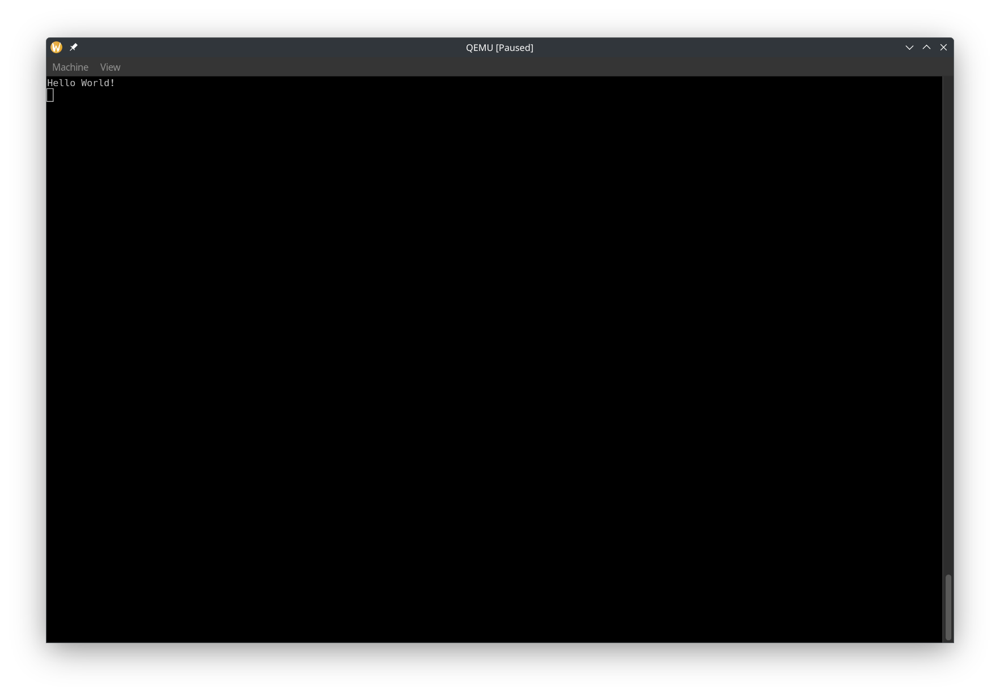

# Hello World!
Now it's time to print "Hello World!" in our kernel. Normally, we would use the `println` macro. But since we are in `no_std`, there is no `println` macro. We can print to the [`COM1` serial port](https://wiki.osdev.org/Serial_Ports) instead. More info: https://os.phil-opp.com/testing/#serial-port. Serial ports let us read and write data. Most modern computers don't have serial ports, but QEMU does. We can access `COM1` through x86 [I/O ports](https://wiki.osdev.org/I/O_Ports) (also see https://wiki.osdev.org/Port_IO). We can read and write to I/O ports using [in](https://www.felixcloutier.com/x86/in) and [out](https://www.felixcloutier.com/x86/out) instructions.

Let's use the `uart_16550` crate. In `kernel/Cargo.toml` dependencies, add
```toml
uart_16550 = "0.3.2"
```
In `kernel/main.rs`, add
```rs
use uart_16550::SerialPort;
```
and
```rs
use core::fmt::Write;
```
Then we can write to COM1 using
```rs
let mut serial_port = unsafe { SerialPort::new(0x3F8) };
serial_port.init();
writeln!(serial_port, "Hello World!\r").unwrap();
```
Now run it, and in the QEMU window, select `View` -> `serial0`. It should look like this:



We can make QEMU not create a window and print COM1 to the terminal by using `-nographic`. Let's also update `tasks.json`. Note that when you specify `-nographic`, you can't close QEMU with `Ctrl + C` and instead have to use `Ctrl + A` and then press `X`.
