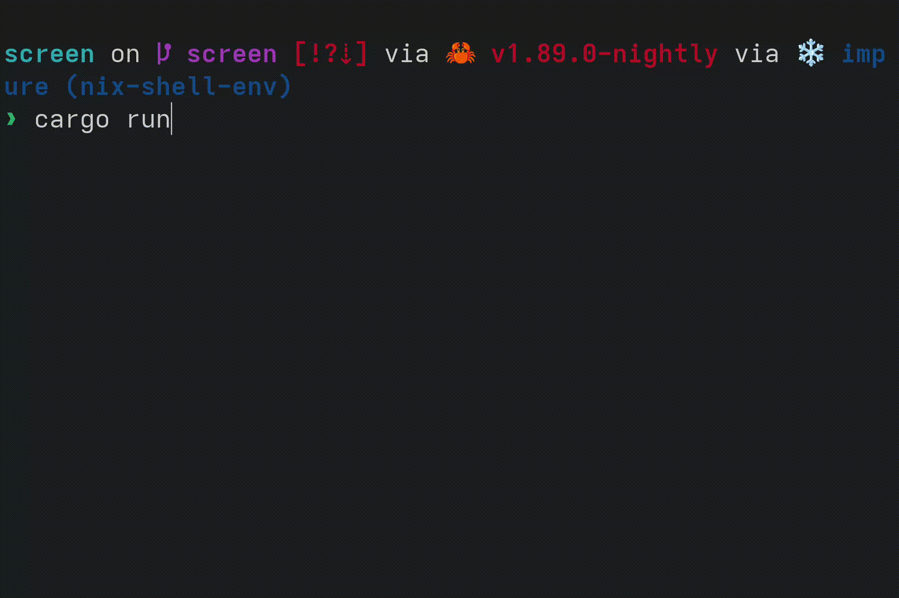

# Drawing to the Screen
Most likely, you will not be able to read from COM1 on if you run the OS on a real computer, or use a debugger on it. So let's draw to the screen to make sure that our OS works on real machines!

To draw to the screen, we will be writing to a region of memory which is memory mapped to a frame buffer. A frame buffer basically represents the pixels on the screen. You typically put a dot on the screen by writing the pixel's RGB values to the region in the frame buffer corresponding to that pixel. Limine makes it easy for us to get a frame buffer. Let's add the Limine request. Before we add the request, let's move all of the Limine-related stuff to it's own module, `limine_requests.rs`. Then let's create the request:
```rs
#[used]
#[unsafe(link_section = ".requests")]
pub static FRAME_BUFFER_REQUEST: FramebufferRequest = FramebufferRequest::new();
```
To draw shapes, text, and more, we'll use the `embedded-graphics` crate. Add it to `kernel/Cargo.toml`:
```toml
embedded-graphics = "0.8.1"
```

Next, let's make a struct for drawing a pixel using the Limine-provided pixel info. Create `rgb_pixel_info.rs`:
```rs
use embedded_graphics::{pixelcolor::Rgb888, prelude::RgbColor};

#[derive(Debug, Clone, Copy)]
pub struct RgbPixelInfo {
    pub red_mask_size: u8,
    pub red_mask_shift: u8,
    pub green_mask_size: u8,
    pub green_mask_shift: u8,
    pub blue_mask_size: u8,
    pub blue_mask_shift: u8,
}

impl RgbPixelInfo {
    /// Technically, Limine and this struct could have a pixel size other than u32, in which case you shouldn't use this method
    pub fn build_pixel(&self, color: Rgb888) -> u32 {
        let mut n = 0;
        n |= ((color.r() as u32) & ((1 << self.red_mask_size) - 1)) << self.red_mask_shift;
        n |= ((color.g() as u32) & ((1 << self.green_mask_size) - 1)) << self.green_mask_shift;
        n |= ((color.b() as u32) & ((1 << self.blue_mask_size) - 1)) << self.blue_mask_shift;
        n
    }
}
```
And also a struct that contains the information from Limine. `frame_buffer_info.rs`:
```rs
use crate::RgbPixelInfo;

#[derive(Debug, Clone, Copy)]
#[non_exhaustive]
pub struct FrameBufferInfo {
    pub width: u64,
    pub height: u64,
    pub pitch: u64,
    pub bits_per_pixel: u16,
    pub pixel_info: RgbPixelInfo,
}

impl From<&limine::framebuffer::Framebuffer<'_>> for FrameBufferInfo {
    fn from(framebuffer: &limine::framebuffer::Framebuffer) -> Self {
        FrameBufferInfo {
            width: framebuffer.width(),
            height: framebuffer.height(),
            pitch: framebuffer.pitch(),
            bits_per_pixel: framebuffer.bpp(),
            pixel_info: RgbPixelInfo {
                red_mask_size: framebuffer.red_mask_size(),
                red_mask_shift: framebuffer.red_mask_shift(),
                green_mask_size: framebuffer.green_mask_size(),
                green_mask_shift: framebuffer.green_mask_shift(),
                blue_mask_size: framebuffer.blue_mask_size(),
                blue_mask_shift: framebuffer.blue_mask_shift(),
            },
        }
    }
}
```

Then create a new file, `frame_buffer_embedded_graphics.rs`. Let's create a wrapper struct that will implement `DrawTarget`, which let's us draw to it with `embedded-graphics`.
```rs
pub struct FrameBufferEmbeddedGraphics<'a> {
    buffer: &'a mut [u32],
    info: FrameBufferInfo,
    pixel_pitch: usize,
    bounding_box: Rectangle,
}

impl FrameBufferEmbeddedGraphics<'_> {
    /// # Safety
    /// The frame buffer must be mapped at `addr`
    pub unsafe fn new(addr: NonZero<usize>, info: FrameBufferInfo) -> Self {
        if info.bits_per_pixel as u32 == u32::BITS {
            Self {
                buffer: {
                    let mut ptr = NonNull::new(slice_from_raw_parts_mut(
                        addr.get() as *mut u32,
                        (info.pitch * info.height) as usize / size_of::<u32>(),
                    ))
                    .unwrap();
                    // Safety: This memory is mapped
                    unsafe { ptr.as_mut() }
                },
                info,
                pixel_pitch: info.pitch as usize / size_of::<u32>(),
                bounding_box: Rectangle {
                    top_left: Point::zero(),
                    size: Size {
                        width: info.width.try_into().unwrap(),
                        height: info.height.try_into().unwrap(),
                    },
                },
            }
        } else {
            panic!("DrawTarget implemented for RGB888, but bpp doesn't match RGB888");
        }
    }
}
```
In the `new` function, we make sure that the bytes per pixel is 4 (R, G, B, and an unused byte). This is because in our drawing logic, we will store each pixel as a `u32`.

Now let's implement the `Dimensions` trait, which is needed for `DrawTarget`:
```rs
impl Dimensions for FrameBufferEmbeddedGraphics<'_> {
    fn bounding_box(&self) -> embedded_graphics::primitives::Rectangle {
        self.bounding_box
    }
}
```

Now let's implement the `DrawTarget` trait:
```rs
impl DrawTarget for FrameBufferEmbeddedGraphics<'_> {
    type Color = Rgb888;

    type Error = Infallible;

    fn draw_iter<I>(&mut self, pixels: I) -> Result<(), Self::Error>
    where
        I: IntoIterator<Item = embedded_graphics::Pixel<Self::Color>>,
    {
        let bounding_box = self.bounding_box();
        pixels
            .into_iter()
            .filter(|Pixel(point, _)| bounding_box.contains(*point))
            .for_each(|Pixel(point, color)| {
                let pixel_index = point.y as usize * self.pixel_pitch + point.x as usize;
                self.buffer[pixel_index] = self.info.pixel_info.build_pixel(color);
            });
        Ok(())
    }
}
```
Now in `main.rs`, let's use embedded graphics to draw to the screen:
```rs
let frame_buffer = FRAME_BUFFER_REQUEST.get_response().unwrap();
if let Some(frame_buffer) = frame_buffer.framebuffers().next() {
    let mut frame_buffer = {
        let addr = frame_buffer.addr().addr().try_into().unwrap();
        let info = (&frame_buffer).into();
        unsafe { FrameBufferEmbeddedGraphics::new(addr, info) }
    };
    frame_buffer.clear(Rgb888::MAGENTA).unwrap();
}
```
Limine gives us a slice of frame buffers, but here we only draw to the first frame buffer, if it exists.



Depending on your host computer, you might notice that this is pretty slow. Let's implement `fill_solid` so that `embedded_graphics` can draw certain shapes, such as rectangles, much faster:
```rs
fn fill_solid(&mut self, area: &Rectangle, color: Self::Color) -> Result<(), Self::Error> {
    let area = area.intersection(&self.bounding_box);
    let pixel = self.info.pixel_info.build_pixel(color);
    let width = area.size.width as usize;
    let top_left_x = area.top_left.x as usize;
    for y in area.top_left.y as usize..area.top_left.y as usize + area.size.height as usize {
        let pixel_index = y * self.pixel_pitch + top_left_x;
        let pixels = &mut self.buffer[pixel_index..pixel_index + width];
        pixels.fill(pixel);
    }
    Ok(())
}
```
Now when we fill the screen, it should draw much faster.


# Learn more
- <https://wiki.osdev.org/Drawing_In_a_Linear_Framebuffer>
- <https://wiki.osdev.org/GOP>
